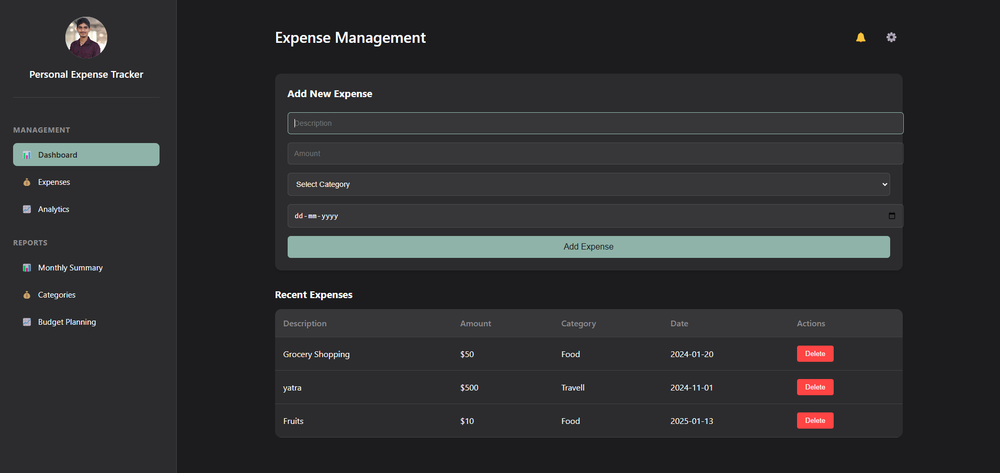

<div align="center">
  <h1>💡 ExpenseIQ</h1>
  <p><strong>Intelligent Personal Finance Tracking Solution</strong></p>

  <p align="center">
    
    
    
    
  </p>
</div>

## 🧠 Smart Features

- 📊 Intelligent expense categorization
- 💰 Real-time expense tracking
- 📈 Smart spending analytics
- 🎯 Budget optimization suggestions
- 📱 Responsive modern interface

## 🛠️ Technology Stack

### Backend Architecture
- Java 17
- Spring Boot 3.x
- Spring Data JPA
- MySQL Database
- RESTful API Design

### Frontend Development
- React.js
- Material-UI
- Axios
- Modern CSS3
- Responsive Design

## 📸 Application Preview

<div align="center">
  
</div>

## 🚀 Quick Start

### Prerequisites
```bash
# Required installations
- Java 17+
- Node.js 14+
- MySQL 8+